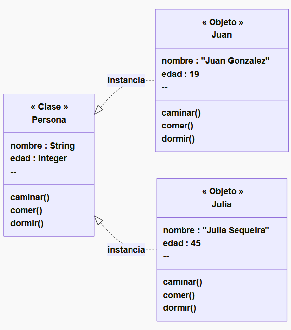
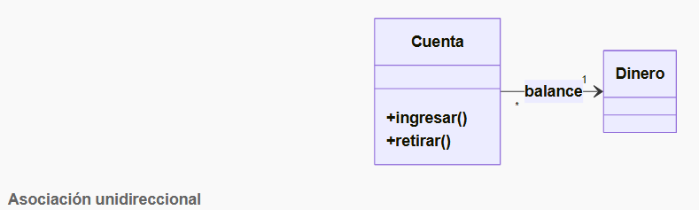
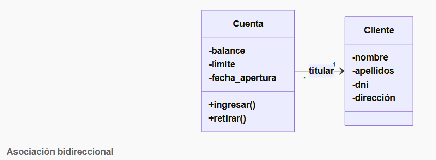
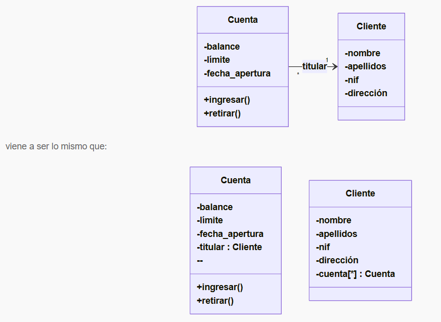
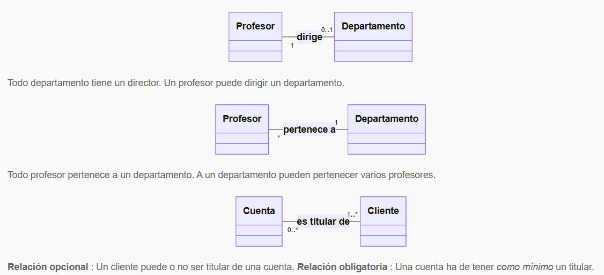
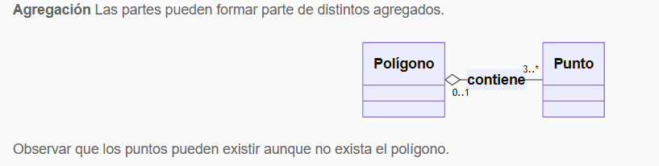
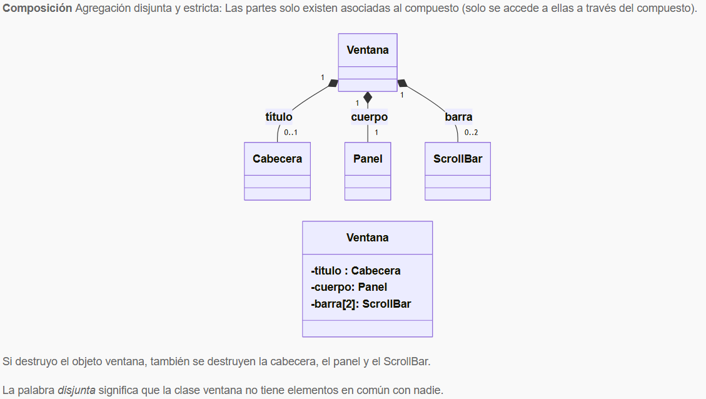

En **UML** una Clase se representan con un *RECTANGULO* dividido en 3 secciones:
- La seccion superior tiene el _nombre_ de la clase que representa.
- Luego siguen los _atributos_ de la clase: `nombreParametro :tipoDeDato`
- Finalmente los _métodos_: `nombreMétodo (tipodatoEntrada nombreDatoEntrada):tipoDatoSalida`


# Asociación entre objetos (o clases)
- Una asociación es una relación que indica que un objeto utiliza o está vinculado con otro objeto, permitiendo la comunicación o colaboración entre ellos.  [CLIENTE]---vive en---[DIRECCIÓN]

_Supongamos que tenemos las clases Profesor y Curso. Una asociación podría representar que: - Un Profesor dicta uno o varios Cursos. - Un Curso es dictado por un Profesor._
_En UML, los diagramas de asociación entre objetos se representan como: - Si las asociaciones se pueden recorrer en ambos sentidos, se usa una línea plana. Si queremos que se recorra sólo en un sentido se utiliza una flecha._

***Asociacion Unidireccional***

***Asociacion Bidireccional***


``` typescript
// archivo: dinero.ts

// Clase auxiliar Dinero (puedes ajustarla según necesidades reales)
export class Dinero {
  private valor: number;

  constructor(valor: number) {
    this.valor = valor;
  }

  public getValor(): number {
    return this.valor;
  }

  public sumar(cantidad: Dinero): void {
    this.valor += cantidad.getValor();
  }

  public restar(cantidad: Dinero): void {
    this.valor -= cantidad.getValor();
  }
}
-----------------------------------------
// archivo: cuenta.ts

// Clase Cuenta
import { Dinero } from "./dinero";

export class Cuenta {
  private balance: Dinero;

  constructor() {
    this.balance = new Dinero(0);
  }

  public ingresar(cantidad: Dinero): void {
    this.balance.sumar(cantidad);
  }

  public retirar(cantidad: Dinero): void {
    this.balance.restar(cantidad);
  }

  public getSaldo(): Dinero {
    return this.balance;
  }
}
-----------------------------------------
// archivo: main.ts

import { Dinero } from "./dinero";
import { Cuenta } from "./cuenta";

const cuenta = new Cuenta();
cuenta.ingresar(new Dinero(100));
cuenta.retirar(new Dinero(30));

console.log("Saldo actual:", cuenta.getSaldo().getValor()); // Saldo actual: 70
```


# Multiplicidad de las asociaciones


Multiplicidad   |   Significado
------------------------------------------------
1	            |   Uno y sólo uno
0..1	        |   Cero o uno
N..M	        |   Desde N hasta M
*	            |   Cero o varios
0..*	        |   Cero o varios
1..*	        |   Uno o varios (al menos uno)

_Cuando la multiplicidad es 0, la relación es opcional._
_Una multiplicidad mayor o igual que 1 establece una relación obligada._
_Si no se especifica la multiplicidad, se supone que es *._

- `Agregación:` una clase “contiene” otras clases (instanciadas).

- `Composición:` una clase A contiene otra clase B , pero es más **estricta** , al punto que la clase B no puede existir si no existe la clase A. (en este caso, se dice que la clase B “pertenece” a la clase A, o que, la clase B es "parte necesaria" de la clase A. Si la clase A se destruye, también se destruye la clase B).


`Agregación vs. Composición`

**AGREGACIÓN**	                                        |   **COMPOSICIÓN**
-------------------------------------------------------------------------------------------------------------------
Relación débil entre las clases	                        |   Relación fuerte
Las clases pueden existir independientemente	        |   No pueden existir independientemente
Una clase tiene una relación de “tiene” a otra clase	|   Una clase tiene la relación de “pertenece” con la otra