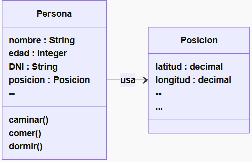
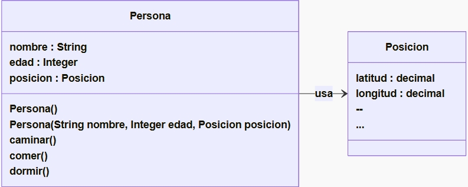

# ¿Que es una 'Clase'?
- Una clase es lo que contiene toda la descripción necesaria (métodos y atributos) para poder crear un objeto.

_La clase nos dice para cada atributo del objeto, si es un int, un String, o si es del tipo de otro objeto._
_Para cada método nos dice si tiene parámetros de entrada, de salida y de qué tipos. (y también nos dice cuáles son los “constructores”)_

## ¡Las clases son tipos de datos!
- Una clase es al fin y al cabo un tipo de dato, por lo tanto, lo mas normal es ver clases que estan compuestas por otras clases.

_Por ejemplo, supongamos la clase "Persona" definida anteriormente, que tiene un nombre, una edad... y ahora queremos agregarle su posición en el planeta(coordenadas). Podríamos decir que el nombre es un String y la edad un Integer ... pero la “Posición” ¿qué sería?. Ya estamos en problemas si queremos utilizar un tipo de datos simple o básico (int, float, string, etc)._

_Entonces podríamos pensar en crear una clase “Posición” que tiene los valores de latitud y longitud._


En **UML** una Clase se representan con un *RECTANGULO* dividido en 3 secciones:
- La seccion superior tiene el _nombre_ de la clase que representa.
- Luego siguen los _atributos_ de la clase: `nombreParametro :tipoDeDato`
- Finalmente los _métodos_: `nombreMétodo (tipodatoEntrada nombreDatoEntrada):tipoDatoSalida`


## ¿Cómo se crea una clase? (constructores)
- Los constructores son métodos especiales , que pueden tener parámetros de entrada (o no) y cuando se invoquen devolverán 
un objeto del mismo tipo que la clase.

- Distinguimos constructores de métodos en UML, porque el constructor se llama igual que la clase y no se indica :<_tipodedato> 
indicando tipo de dato de salida.


## ¿Cómo se declara una Clase en Typescript?
``` typescript
// archivo: posicion.ts

// Clase Posicion (en lugar de interface)
export class Posicion {
  public x: number;
  public y: number;

  constructor(x: number, y: number) {
    this.x = x;
    this.y = y;
  }
}
-----------------------------------------------
// archivo: persona.ts

// Clase Persona
export class Persona {
  public nombre: string;
  public edad: number;
  public posicion: Posicion;

  // Constructores del UML (sobrecarga)
  constructor();
  constructor(nombre: string, edad: number, posicion: Posicion);
  constructor(nombre?: string, edad?: number, posicion?: Posicion) {
    this.nombre = nombre ?? "";
    this.edad = edad ?? 0;
    this.posicion = posicion ?? { x: 0, y: 0 };
  }

  public caminar(): void {
    // implementar comportamiento
  }

  public comer(): void {
    // implementar comportamiento
  }

  public dormir(): void {
    // implementar comportamiento
  }

  public viajarA(posicion: Posicion): boolean {
    if (!posicion) return false;
    this.posicion = posicion;
    return true;
  }
}
-----------------------------------------------
// archivo: main.ts
import { Persona } from "./persona";
import { Posicion } from "./posicion";

const posicionInicial = new Posicion(10, 20);
const juan = new Persona("Juan", 30, posicionInicial);

juan.caminar();
juan.comer();
juan.dormir();

const nuevaPosicion = new Posicion(100, 200);
const resultado = juan.viajarA(nuevaPosicion);

console.log(`¿Viaje exitoso? ${resultado}`);
console.log(`Nueva posición de Juan: (${juan.posicion.x}, ${juan.posicion.y})`);
```

## Instanciar una Clase
- Suponiendo que ya tenemos creado el archivo `persona.ts` con el código de la clase dentro, ahora queremos crear un objeto de tipo Persona.
Para crear objetos se utiliza new y el nombre del constructor que elijamos.
``` typescript
Persona juan = new Persona();
// es lo mismo que : 
Persona juan;
juan = new Persona();
```
**¿Qué pasa cuando hacemos: Persona juan = new Persona(); ?**
1. Se declara una variable llamada juan del tipo Persona .
2. Se crea un objeto en la memoria del tipo Persona .
3. Se llama al constructor Persona() .
4. La variable juan queda apuntando al objeto creado.


**¿Qué pasa cuando hacemos: Persona juan = new Persona( “Juan Gonzalez” , "23", null); ?**
- Estamos usando otro contructor, que tiene más parámetros de entrada (o tal vez, el mismo contructor pero sin los parámetros por omisión)


## Acceder a una Clase
¿Cómo hago para acceder a los atributos y/o métodos de una clase?

En Typescript se escribe así: <nombre de la variable>.<nombre -método/nombre -atributo>

``` typescript
// Por ejemplo si al objeto que apunta la variable “juan ” queremos asignarle una nueva edad:
juan.edad = 37;

// Ejemplos de instancias
Persona juan = new Persona( “Juan ”,null,null);
Persona pepe = new Persona( “Pepe”,null,null);
```
