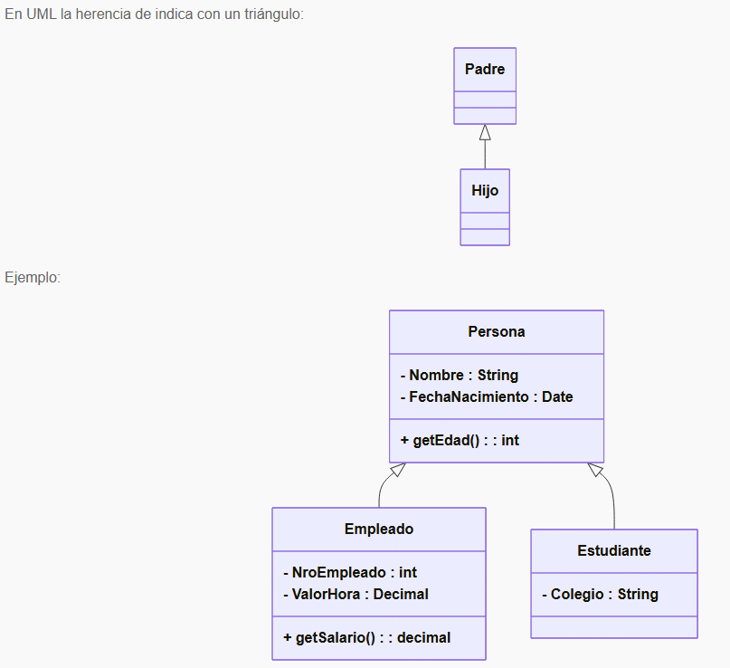

# Herencia
- La herencia es un mecanismo que permite a una nueva clase heredar los atributos y métodos de otra clase ya existente.

Supongamos tenemos que queremos modelar un sistema para llevar registro de Estudiantes y de Empleados .
Todos los estudiantes y empleados tienen una fecha de nacimiento y un nombre, se solicita poder calcularles la edad.

Por otro lado, tenemos a los empleados, que tendrán un número de empleado y una cierta cantidad de dinero que ganan por hora.. Quisiéramos saber el salario mensual de cada empleado, sabiendo que se calcula como "precio por hora * 160" , de los estudiantes por el momento sólo nos interesa el nombre del colegio al que asisten.



Podemos ver en el diagrama de arriba que las clases Hijas Empleados y Estudiantes, tendrán los atributos `nombre`, `fechaNacimiento`
y el método `getEdad()`, sin necesidad de tenerlos explícitamente declarados en su clase, ya que lo heredan de la clase padre. Estaremos escribiendo el código solo una vez (en la clase Persona) y reutilizándolo 2 veces.

``` typescript
// archivo: persona.ts
export class Persona {
  private nombre: string;
  private fechaNacimiento: Date;

  constructor(nombre: string, fechaNacimiento: Date) {
    this.nombre = nombre;
    this.fechaNacimiento = fechaNacimiento;
  }

  public getEdad(): number {
    const hoy = new Date();
    let edad = hoy.getFullYear() - this.fechaNacimiento.getFullYear();
    const m = hoy.getMonth() - this.fechaNacimiento.getMonth();
    if (m < 0 || (m === 0 && hoy.getDate() < this.fechaNacimiento.getDate())) {
      edad--;
    }
    return edad;
  }

  public getNombre(): string { return this.nombre; }
  public setNombre(n: string): void { this.nombre = n; }
  public getFechaNacimiento(): Date { return this.fechaNacimiento; }
  public setFechaNacimiento(f: Date): void { this.fechaNacimiento = f; }
}
----------------------------------------------
// archivo: empleado.ts
import { Persona } from "./persona";

export class Empleado extends Persona {
  private nroEmpleado: number;
  private valorHora: number;

  constructor(
    nombre: string,
    fechaNacimiento: Date,
    nroEmpleado: number,
    valorHora: number
  ) {
    super(nombre, fechaNacimiento);
    this.nroEmpleado = nroEmpleado;
    this.valorHora = valorHora;
  }

  public getSalario(): number {
    return this.valorHora * 160;
  }

  public getNroEmpleado(): number { return this.nroEmpleado; }
  public setNroEmpleado(n: number): void { this.nroEmpleado = n; }
  public getValorHora(): number { return this.valorHora; }
  public setValorHora(v: number): void { this.valorHora = v; }
}
-----------------------------------------------
// archivo: estudiante.ts
import { Persona } from "./persona";

export class Estudiante extends Persona {
  private colegio: string;

  constructor(nombre: string, fechaNacimiento: Date, colegio: string) {
    super(nombre, fechaNacimiento);
    this.colegio = colegio;
  }

  public getColegio(): string { return this.colegio; }
  public setColegio(c: string): void { this.colegio = c; }
}
--------------------------------------------------
// main.ts (ejemplo de uso)
import { Empleado } from "./empleado";
import { Estudiante } from "./estudiante";

const emp = new Empleado("Ana", new Date(1990, 4, 12), 1234, 10.5);
console.log(emp.getSalario(), emp.getEdad());

const est = new Estudiante("Luis", new Date(2008, 10, 3), "Colegio Central");
console.log(est.getColegio(), est.getEdad());
```
