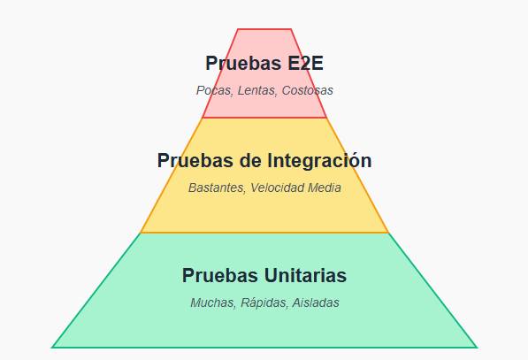

# La Estrategia de Pruebas: La Pirámide

No todas las prueabs son iguales. Una estrategia de testing robusta se visualiza comunmente como piramide, donde cada nivel representa un tipo de prueba con un proposito, costo y velocidad diferentes. La idea es tener muchas pruebas rapidas y baratas en la base y muy pocas pruebas lentas y costosas en la cima.

