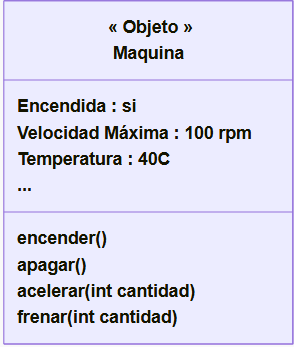

### ¿Que es un objeto?
- Es una entidad (algo) que tiene un estado, un comportamiento y una identidad.
- Los *atributos* serian el "estado" del objeto (valores). Y los *métodos* serian las "cosas que le podemos pedir".

_Al momento de diseñar un programa orientado a objetos, podríamos decir que un objeto es: “cualquier cosa , real o abstracta, en la que se almacenan datos y aquellos métodos (operaciones) que manipulan los datos”_

